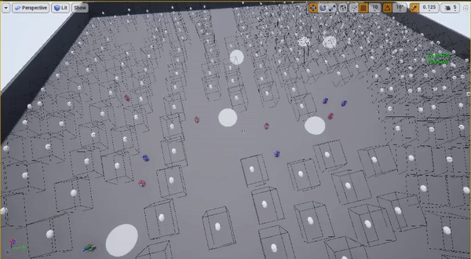

# CornerCulling
Fast, maximally accurate, and latency resistant culling method.  
Proof of concept in C++ and UE4.
Uses ray/occluding object intersection tests to check lines of sight from a player's possible locations (due to latency) to the corners of the bounding volumes of enemies.

#### Latest Demos
Accuracy:  
  
Speed (edges not rendered to maintain frames per second):  
  

## Technical Details

Instead of using slow ray marches or approximations like PVS, we use analytical geometry to calculate if each potential line of sight is blocked an occluding object. A huge speed gain comes from caching recent occluders--that which blocked LOS a few milliseconds ago will almost surely block LOS now. We are currently implementing a ray cast acceleration structure (Bounding Volume Hierarchy) for O(log(n)) object lookup on cache misses. This fast lookup is unnecessary for tactical shooters with ~10 players and ~300 occluders, but it can enable more complex LOS checks that increase accuracy in some situations. This fast lookup is necessary for BR games with 50+ players and thousands of occluders. A PVS first pass could also increase performance.  

Also, we must account for latency to prevent popping. To do so, one should check LOS not from the player's last known position, but from the most aggressive positions they could peek. A practical method to check all such positions is to, on the plane normal to the line from player to enemy, calculate the four corners of the rectangle that contains all possible peeks. Then let an object cull an enemy only when lines of sight from all four corners are blocked.  

By accounting for latency, we can also afford to speed up average culling time by a factor of K by culling once every K ticks. Compared to a 100 ms ping, the added delay of culling every 30 ms instead of 10 ms is relatively small--but results in a 3x speedup. When running multiple server instances per CPU, one should test if it is better to spread out the culling over multiple ticks for all game server instances or to stagger the full culling cycle of each instance. For example, when running 2 servers, one could either cull one whole server on alternative ticks or cull 50% of each server each tick.  

Another big performance trick is to keep enemies revealed for a few culling cycles. It can be expensive to calculate that an enemy is revealed, as many occluders must be checked to determine that none of them block LOS. Keeping enemies revealed for an extra ~100 ms does not confer a big advantage to wallhackers, but could drastically increase speed. This lingering visibility timer can adapt to server load.

## Priority Tasks
- Implement bounding volume hierarchy
- Talk to engineers at Umbra

## Other Tasks (in no order):
- Implement potentially visible sets to pre-cull enemies.
- Reach out to graphics experts for review and advice
- Consider ways to partially occlude enemies, trimming down their bounding boxes.
  Currently, if two objects each occlude 99% of an enemy, the enemy is still visible because a sliver
  of their left is visible to one box, and a sliver of their right is visible to another.
  We would have to implement a polyhedra clipping algorithm, or some discrete approximation of it.
  Alternatively, subdivide one bounding box into many, and cull those individually.
- Consider sending fake enemy locations to throw off cheaters.

## Research

### Occlusion Culling:  
- http://www.cs.unc.edu/~zhangh/hom.html  
- https://www.gamasutra.com/view/feature/131388/rendering_the_great_outdoors_fast_.php?page=3  
- https://medium.com/@Umbra3D/introduction-to-occlusion-culling-3d6cfb195c79  

### Improved bounding boxes (k-dops):  
- https://www.youtube.com/watch?v=h4GBU-NXJ1c  

### Faster raytracing:  
- Real-Time Rendering, Fourth Edition  <-- Read it. It's very good.
- http://www0.cs.ucl.ac.uk/staff/j.kautz/teaching/3080/Slides/16_FastRaytrace.pdf
- https://www.cs.cmu.edu/afs/cs/academic/class/15462-s09/www/lec/14/lec14.pdf
- https://hwrt.cs.utah.edu/papers/hwrt_siggraph07.pdf
- http://webhome.cs.uvic.ca/~blob/courses/305/notes/pdf/Ray%20Tracing%20with%20Spatial%20Hierarchies.pdf
- https://stackoverflow.com/questions/99796/when-to-use-binary-space-partitioning-quadtree-octree

### Fast geometric intersection algorithms
- https://en.wikipedia.org/wiki/Intersection_of_a_polyhedron_with_a_line
- https://tavianator.com/cgit/dimension.git/tree/libdimension/bvh/bvh.c#n196
- http://paulbourke.net/geometry/circlesphere/index.html#linesphere
 
### Potentially Useful Geomeotry
- https://en.wikipedia.org/wiki/Back-face_culling
- https://en.wikipedia.org/wiki/Clipping_(computer_graphics)

### Note on unoriginaliy
My idea is basically shadow culling, which graphics researchers documented in 1997.  
- https://www.gamasutra.com/view/feature/3394/occlusion_culling_algorithms.php?print=1  
- [Coorg97] Coorg, S., and S. Teller, "Real-Time Occlusion Culling for Models with Large Occluders", in Proceedings 1997 Symposium on Interactive 3D Graphics, pp. 83-90, April 1997.  
- [Hudson97b] Hudson, T., D. Manocha, J. Cohen, M. Lin, K. Hoff and H. Zhang, "Accelerated Occlusion Culling using Shadow Frusta", Thirteenth ACM Symposium on Computational Geometry, Nice, France, June 1997.  

### Inspiring Graphics Libraries:  
- https://www.cgal.org/  
- https://www.geometrictools.com/  
- https://docs.unrealengine.com/en-US/API/Runtime/Core/Math/FMath/index.html  
