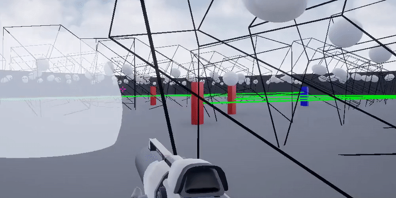

# CornerCulling
Improved server-side occlusion culling. Wallhack hand sanitizer.  
We use ray casts to maximize the accuracy and improve the speed and scalability of currently deployed anti-wallhack solutions, even in high latency settings.

## Latest demos
Accuracy:  
  
Speed:  
  
Correctness with latency (100 ms):  
  

## Technical details

Instead of using slow ray marches or approximations like Potentially Visible Sets (PVS), we use analytical ray casts to calculate if each potential line of sight is blocked an occluding object. A huge speed gain comes from caching recent occluders--as occluders that blocked LOS recently are likely to block LOS now. We have also implemented a ray cast acceleration structure (bounding volume hierarchy) for O(log(n)) object lookup on cache misses, enabling our solution to scale to large, complex maps. This structure, combined with a PVS first pass, enables this system to protect BR games with 50+ players and thousands of occluders.

We also account for latency to prevent popping. To do so, we check LOS not from the player's last known position, but from all locations they could have moved to. Our method for checking all such positions is to, on the plane that contains the player and is normal to the line from player to enemy, calculate the four corners of the rectangle that contains all possible peeks. Then we cull the enemy if and only if a single convex occluder blocks all four lines of sight.  

By accounting for latency, we can also afford to speed up average culling time by not culling every tick. Compared to a 100 ms ping, the added delay of culling every 30 ms instead of 10 ms is relatively small--but results in a 3x speedup. Note that, when running multiple server instances per CPU, one should test if it is better to spread out the culling over multiple ticks for all game server instances or to stagger the full culling cycle of each instance. For example, when running 2 servers, one could either cull each whole server on alternating ticks or cull 50% of each server each tick.  

## Regarding PVS

In executed well, PVS is a viable alternative on small maps without dynamic geometry. Runtime performance would be good, and accuracy would be close. On Dust 2 or Ascent, you would need approximately a (200, 200, 10) grid. It's only 20 GB on the sever's disk (hash table lookup should be fine, no need for space-filling curve cache optimizations). Latency lookahead is also simple. Still, you would need a simple ray cast system to handle smokes and moving doors.

## Priorities
- Ship to VALORANT
- Ship to CS:GO
  - Create SourceMod CS:GO plugin
  - Present side-by-side demo

## Other tasks (in no order):
- Clean up code and documentation
- Implement occluding cylinders
- Implement potentially visible sets to pre-cull enemies.
- Contact engineers at Umbra (to automate mapping)
- Reach out to graphics experts for review
- Implement ways to partially occlude enemies, trimming down their bounding boxes.
  Currently, if two objects each occlude 99% of an enemy, the enemy is still visible because a sliver
  of their left is visible to one box, and a sliver of their right is visible to another.
  We would have to implement a polyhedra clipping algorithm, or some discrete approximation of it.
  Alternatively, subdivide one bounding box into many, and cull those individually.
- Design method to send fake enemy locations.
- Design a secure sound system.

## Research

### Occlusion culling:  
- http://www.cs.unc.edu/~zhangh/hom.html  
- https://www.gamasutra.com/view/feature/131388/rendering_the_great_outdoors_fast_.php?page=3  
- https://medium.com/@Umbra3D/introduction-to-occlusion-culling-3d6cfb195c79  
- https://www.gamasutra.com/view/feature/3394/occlusion_culling_algorithms.php?print=1  
- [Coorg97] Coorg, S., and S. Teller, "Real-Time Occlusion Culling for Models with Large Occluders", in Proceedings 1997 Symposium on Interactive 3D Graphics, pp. 83-90, April 1997.  
- [Hudson97b] Hudson, T., D. Manocha, J. Cohen, M. Lin, K. Hoff and H. Zhang, "Accelerated Occlusion Culling using Shadow Frusta", Thirteenth ACM Symposium on Computational Geometry, Nice, France, June 1997.  

### Improved bounding boxes (k-dops):  
- https://www.youtube.com/watch?v=h4GBU-NXJ1c  

### Faster raytracing:  
- Real-Time Rendering, Fourth Edition  <-- Read it. It's very good.
- http://www0.cs.ucl.ac.uk/staff/j.kautz/teaching/3080/Slides/16_FastRaytrace.pdf
- https://www.cs.cmu.edu/afs/cs/academic/class/15462-s09/www/lec/14/lec14.pdf
- https://hwrt.cs.utah.edu/papers/hwrt_siggraph07.pdf
- http://webhome.cs.uvic.ca/~blob/courses/305/notes/pdf/Ray%20Tracing%20with%20Spatial%20Hierarchies.pdf
- https://stackoverflow.com/questions/99796/when-to-use-binary-space-partitioning-quadtree-octree

### BVH construction
- http://fileadmin.cs.lth.se/cs/Education/EDAN30/lectures/S2-bvh.pdf
- https://github.com/brandonpelfrey/Fast-BVH (BVH source code adapted from)

### Fast geometric intersection algorithms
- https://en.wikipedia.org/wiki/Intersection_of_a_polyhedron_with_a_line
- https://tavianator.com/cgit/dimension.git/tree/libdimension/bvh/bvh.c#n196
- http://paulbourke.net/geometry/circlesphere/index.html#linesphere
 
### Potentially useful geomeotry
- https://en.wikipedia.org/wiki/Back-face_culling
- https://en.wikipedia.org/wiki/Clipping_(computer_graphics)

### Inspiring graphics libraries:  
- https://www.cgal.org/  
- https://www.geometrictools.com/  
- https://docs.unrealengine.com/en-US/API/Runtime/Core/Math/FMath/index.html  
